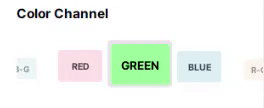

# 3DColorPicker


직접 만든 Java Swing 기반의 3D 회전 휠 스타일 색상 채널 선택기 컴포넌트입니다.  
부드러운 애니메이션과 파스텔 컬러 UI를 적용하여 직관적이고 세련된 사용자 경험을 제공합니다.
데모에는 컬러를 선택하는데 사용했지만 다른쪽으로 사용해도 좋을지도~?

## 주요 특징
- 터치모니터/마우스 드래그 기반 인터랙션
- 채널 순환 회전 느낌 구현
- 3D 시각 효과 (스케일, 위치, 투명도 기반)
- 파스텔톤 색상 구성
- 외부 콜백 연동 가능 (선택 변경 이벤트)

## 데모



##  사용 예시

```java
ColorChannelSelector selector = new ColorChannelSelector();
selector.setOnSelectionChanged(channel -> {
    System.out.println("선택된 채널: " + channel);
});
